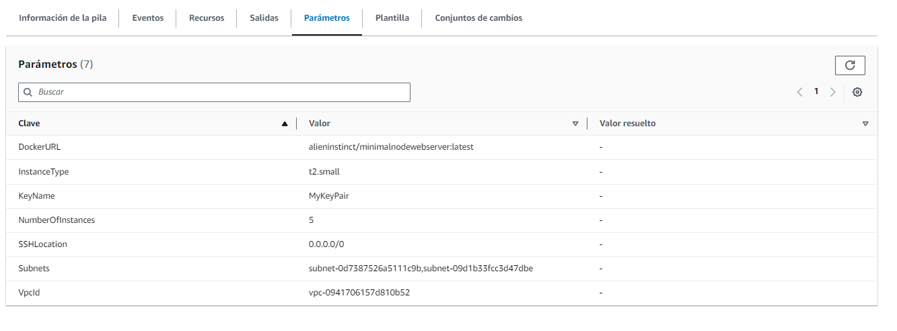

# WEB APP AUTOMATICALLY DEPLOYED TO AWS

## Resumen
Este repositorio contiene el resultado de un experimento con cloud formation, tiene cómo objetivo desplegar una solución contenerizada con docker en una seríe de instancias EC2 definidas por párametro por el usuario. 

## Detalles técnicos del proyecto
- [npm](https://www.npmjs.com/)
- [Docker](https://www.docker.com/)
- [Cloudformation](https://docs.aws.amazon.com/es_es/AWSCloudFormation/latest/UserGuide/Welcome.html)

## Features 
- Servidor web simple de express que expone contenido estatico  en un puerto especificado. 

## Documentación de la solución

### Vista de Arquitectura


En esta vista se exponen los componentes principales de la solución. 
- Balanceador de carga: Expone la solución de todas las instancias EC2 creadas
- MyLaunchConfig: Configuración detallada del arquetipo de servidor EC2
```yml
MyLaunchConfig:
    Type: 'AWS::AutoScaling::LaunchConfiguration'
    Properties:
      ImageId: !FindInMap 
        - AWSRegionArch2AMI
        - !Ref 'AWS::Region'
        - !FindInMap 
          - AWSInstanceType2Arch
          - !Ref InstanceType
          - Arch
      SecurityGroups:
        - !Ref WebServerSecurityGroup
      
      InstanceType: !Ref InstanceType
      KeyName: !Ref KeyName
      UserData:
        Fn::Base64: !Sub |
          #!/bin/bash
          yum update -y
          sudo yum install -y docker
          sudo service docker start
          sudo usermod -a -G docker ec2-user
          sudo docker run -d -p 80:80 ${DockerURL}
```
- MyAutoScalingGroup: Grupo que se encarga de definir la cantidad de instancias de EC2 con configuración MyLaunchConfig a instanciar. 
```yml
 MyAutoScalingGroup:
    Type: 'AWS::AutoScaling::AutoScalingGroup'
    Properties:
      TargetGroupARNs:
        - !Ref ALBTargetGroup
      VPCZoneIdentifier: !Ref Subnets
      LaunchConfigurationName: !Ref MyLaunchConfig
      MinSize: !Ref NumberOfInstances
      MaxSize: !Ref NumberOfInstances
```
- ALB Listener: Escucha las solicitudes por el puerto 80 y las envía al target group
- ALBTargetGroup: Grupo destino que será referenciado por las reglas de auto-escalado


### *DockerFile*
Documento que especifica las dependencias para el micro-contenedor docker. En este caso la solución define un entorno de ejecución en una imagen estable de node slim con un puerto de exposición definido por configuración (80 en este caso).  
<details><summary>Desplegar Código fuente</summary>
<p>

#### Encontrado en DockerFile

```dockerfile

# Fetching the minified node image on apline linux
FROM node:slim

# Declaring env
ENV NODE_ENV development

# Setting up the work directory
WORKDIR /express-docker

# Copying all the files in our project
COPY . .

# Installing dependencies
RUN npm install

# Starting our application
CMD [ "node", "webserver.js" ]

# Exposing server port
EXPOSE 80
```
</details></p>


## Instalación 

### Construir la solución usando el DockerFile
```sh
$ docker build -t webserver .
```

### Ejecución de la solución en entorno local 
```sh
$ docker run -d -p 80:80 webserver
```

### Publicar la imagen de la solución en su repositorio de Dockerhub
1. Reemplazé el literal < dockerhubrepo > con el repositorio dockkerhub de su preferencia
```sh
$ docker image tag webserver <dockerhubrepo>/minimalnodewebserver:latest
$ docker image push <dockerhubrepo>/minimalnodewebserver:latest
```

Ejecute el comando de cloudformation para desplegar la solución. 
Sustituya los valores correspondientes a su entorno de AWS en el archivo parameter.json
```sh
$ aws cloudformation deploy --stack-name minimalwebserverdeploy --template-file template.yml --parameter-overrides file://parameters.json
```
parameter.json
```dockerfile

[
    {
        "ParameterKey": "DockerURL",
        "ParameterValue": "alieninstinct/minimalnodewebserver:latest"
    },
    {
        "ParameterKey": "InstanceType",
        "ParameterValue": "t2.small"
    },
    {
        "ParameterKey": "SSHLocation",
        "ParameterValue": "0.0.0.0/0"
    },
    {
        "ParameterKey": "NumberOfInstances",
        "ParameterValue": "5"
    },
    {
        "ParameterKey": "VpcId",
        "ParameterValue": "vpc-0941706157d810b52"
    },
    {
        "ParameterKey": "Subnets",
        "ParameterValue": "subnet-0d7387526a5111c9b,subnet-09d1b33fcc3d47dbe"
    },
    {
        "ParameterKey": "KeyName",
        "ParameterValue": "MyKeyPair"
    }
]
```

### Resultados de despliegue

Estado de la pila


URL Del Balanceador de carga


Parametros


Instancias EC2 Creadas 


Pruebas Instancia #1


Pruebas Instancia #2


Pruebas Instancia #3


Pruebas Instancia #4


Pruebas Instancia #5


Pruebas Balanceador de carga

